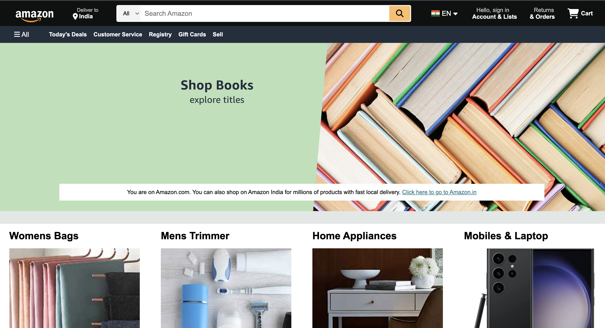

# 🛒 Amazon Clone (Frontend Only)

A **fully responsive** Amazon clone built using **HTML, CSS, and JavaScript**, replicating the UI and layout of Amazon’s homepage.

## 🚀 Features
- 📱 **Responsive Design** (Mobile, Tablet, Desktop)
- 🎭 **Hero Image Slider**
- 🛒 **Cart & Account Dropdown**
- 🌍 **Language Selection Menu**
- 🔍 **Search Bar with Hover Effect**
- 📦 **Product Sections with Images**
- ⚡ **Interactive Navbar & Footer**

## 📸 Screenshots

## 🛠️ Technologies Used
- **HTML5**
- **CSS3**
- **FontAwesome (Icons)**

## 📂 Folder Structure
